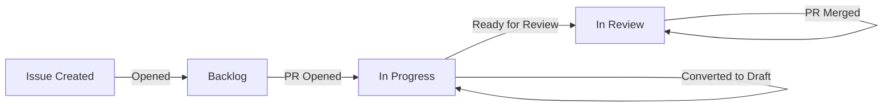

# Issue & PR Automation Suite 🤖

[](https://github.com/marketplace/actions/issue-pr-automation-suite)
[](https://opensource.org/licenses/MIT)

A comprehensive GitHub Action that automates issue and pull request workflows including:

- 📋 **Project Board Integration** - Automatically add issues to GitHub Projects V2 and update status based on PR lifecycle
- 🏷️ **Label & Milestone Sync** - Keep labels and milestones synchronized between linked issues and PRs
- 🔒 **ZAP Security Scan Auto-labeling** - Automatically label ZAP security scan report issues

## Quick Start

```yaml
- uses: SillyLittleTech/AutomationSuite@v1
  with:
    github-token: ${{ secrets.GITHUB_TOKEN }}
```

## Version Pinning

We recommend pinning to a specific version for stability:

- `@v1` - Latest v1.x.x release (recommended for most users)
- `@v1.0.0` - Specific release version (maximum stability)
- `@main` - Latest development version (not recommended for production)

## Features

### 🎯 Project Board Automation

- **New Issues**: Automatically adds opened issues to your GitHub Projects V2 board in "Backlog" status
- **PR Status Updates**: Updates linked issue status based on PR lifecycle:
  - PR opened/converted to draft → Issue moves to "In Progress"
  - PR ready for review → Issue moves to "In Review"
  - PR merged → Issue moves to "In Review" (customizable)
  - PR closed without merge → Issue status unchanged

### 🔄 Label & Milestone Synchronization

- **Bidirectional Label Sync**: Labels are automatically synchronized between issues and their linked PRs
  - When issue labels change → Updates all linked open PRs
  - When PR opens → Inherits labels from all linked issues
- **Smart Milestone Sync**: Milestones are intelligently synchronized
  - Issue has milestone, PR doesn't → Apply issue milestone to PR
  - PR has milestone, issue doesn't → Apply PR milestone to issue

### 🔐 ZAP Security Scan Auto-labeling

- Automatically detects issues with "ZAP Scan Baseline Report" in the title
- Applies configurable labels (default: `Meta`, `Stylistic`, `javascript`, `meta:seq`, `ZAP!`)
- Triggers on issue creation and edits

## Usage

### Basic Setup

Create a workflow file (e.g., `.github/workflows/automation.yml`) in your repository:

```yaml
name: Issue & PR Automation

on:
  issues:
    types: [opened, closed, reopened, labeled, unlabeled, milestoned, demilestoned, edited]
  pull_request:
    types: [opened, closed, reopened, ready_for_review, converted_to_draft, synchronize, edited]
  pull_request_target:
    types: [opened, synchronize]

permissions:
  issues: write
  pull-requests: write
  repository-projects: write
  contents: read

jobs:
  automation:
    runs-on: ubuntu-latest
    steps:
      - name: Run Automation Suite
        uses: SillyLittleTech/AutomationSuite@v1
        with:
          github-token: ${{ secrets.GITHUB_TOKEN }}
          project-name: "My Project"
```

### Advanced Configuration

Customize the behavior with input parameters:

```yaml
- name: Run Automation Suite
  uses: SillyLittleTech/AutomationSuite@v1
  with:
    github-token: ${{ secrets.GITHUB_TOKEN }}
    project-name: "Portfolio Devmt"
    enable-project-automation: "true"
    enable-label-sync: "true"
    enable-zap-labeling: "true"
    zap-labels: "security,automated,zap-scan,needs-review"
```

### Selective Features

Enable only specific features:

#### Project Board Automation Only

```yaml
- name: Project Board Automation
  uses: SillyLittleTech/AutomationSuite@v1
  with:
    github-token: ${{ secrets.GITHUB_TOKEN }}
    project-name: "Sprint Board"
    enable-project-automation: "true"
    enable-label-sync: "false"
    enable-zap-labeling: "false"
```

#### Label & Milestone Sync Only

```yaml
- name: Label & Milestone Sync
  uses: SillyLittleTech/AutomationSuite@v1
  with:
    github-token: ${{ secrets.GITHUB_TOKEN }}
    enable-project-automation: "false"
    enable-label-sync: "true"
    enable-zap-labeling: "false"
```

#### ZAP Auto-labeling Only

```yaml
- name: ZAP Security Issue Labeling
  uses: SillyLittleTech/AutomationSuite@v1
  with:
    github-token: ${{ secrets.GITHUB_TOKEN }}
    enable-project-automation: "false"
    enable-label-sync: "false"
    enable-zap-labeling: "true"
    zap-labels: "security,zap,needs-triage"
```

## Input Parameters

| Input | Description | Required | Default |
|-------|-------------|----------|---------|
| `github-token` | GitHub token for API access | Yes | `${{ github.token }}` |
| `project-name` | Name of GitHub Projects V2 project | No | `Portfolio Devmt` |
| `enable-project-automation` | Enable project board automation | No | `true` |
| `enable-label-sync` | Enable label/milestone sync | No | `true` |
| `enable-zap-labeling` | Enable ZAP issue auto-labeling | No | `true` |
| `zap-labels` | Comma-separated labels for ZAP issues | No | `Meta,Stylistic,javascript,meta:seq,ZAP!` |

## How It Works

### Issue Linking

The action detects linked issues in PRs using multiple patterns:

- Direct reference: `#123`
- Closing keywords: `closes #123`, `fixes #456`, `resolves #789`
- Full URLs: `https://github.com/owner/repo/issues/123`

### Project Board Status Flow



### Label Synchronization Flow

- **Issue labeled** → All linked open PRs receive the same labels
- **Issue unlabeled** → Labels removed from all linked open PRs
- **PR opened** → Inherits all labels from linked issues
- **Bidirectional** → Changes propagate in both directions

## Examples

### Example 1: Full Automation with Custom Project

```yaml
name: Complete Automation Suite

on:
  issues:
    types: [opened, closed, reopened, labeled, unlabeled, milestoned, demilestoned, edited]
  pull_request:
    types: [opened, closed, reopened, ready_for_review, converted_to_draft, synchronize, edited]

permissions:
  issues: write
  pull-requests: write
  repository-projects: write
  contents: read

jobs:
  automation:
    runs-on: ubuntu-latest
    steps:
      - name: Run Full Automation
        uses: SillyLittleTech/AutomationSuite@v1
        with:
          github-token: ${{ secrets.GITHUB_TOKEN }}
          project-name: "Development Board"
          zap-labels: "security,scan,automated,needs-review"
```

### Example 2: Multiple Jobs for Different Features

```yaml
name: Modular Automation

on:
  issues:
    types: [opened, closed, reopened, labeled, unlabeled, milestoned, demilestoned, edited]
  pull_request:
    types: [opened, closed, reopened, ready_for_review, converted_to_draft, synchronize, edited]

permissions:
  issues: write
  pull-requests: write
  repository-projects: write
  contents: read

jobs:
  project-management:
    name: Project Board Sync
    runs-on: ubuntu-latest
    if: github.event_name == 'issues' || github.event_name == 'pull_request'
    steps:
      - uses: SillyLittleTech/AutomationSuite@v1
        with:
          github-token: ${{ secrets.GITHUB_TOKEN }}
          project-name: "Sprint Planning"
          enable-label-sync: "false"
          enable-zap-labeling: "false"

  label-sync:
    name: Label & Milestone Sync
    runs-on: ubuntu-latest
    steps:
      - uses: SillyLittleTech/AutomationSuite@v1
        with:
          github-token: ${{ secrets.GITHUB_TOKEN }}
          enable-project-automation: "false"
          enable-zap-labeling: "false"

  security-labeling:
    name: Security Scan Labeling
    runs-on: ubuntu-latest
    if: github.event_name == 'issues'
    steps:
      - uses: SillyLittleTech/AutomationSuite@v1
        with:
          github-token: ${{ secrets.GITHUB_TOKEN }}
          enable-project-automation: "false"
          enable-label-sync: "false"
          zap-labels: "security,vulnerability,zap-baseline"
```

### Example 3: Security-Focused Setup

```yaml
name: Security Automation

on:
  issues:
    types: [opened, edited]

permissions:
  issues: write

jobs:
  security-triage:
    runs-on: ubuntu-latest
    steps:
      - name: Auto-label Security Scans
        uses: SillyLittleTech/AutomationSuite@v1
        with:
          github-token: ${{ secrets.GITHUB_TOKEN }}
          enable-project-automation: "false"
          enable-label-sync: "false"
          enable-zap-labeling: "true"
          zap-labels: "security,automated-scan,needs-triage,zap-report"
```

## Prerequisites

### GitHub Projects V2

For project board automation to work:

1. Create a GitHub Projects V2 board (user or organization level)
2. Ensure the board has a "Status" field with the following options:
   - `Backlog` (for new issues)
   - `In Progress` (for issues with open PRs)
   - `In Review` (for issues with PRs ready for review)
3. Set the `project-name` input to match your project's exact name

### Permissions

The workflow requires the following permissions:

```yaml
permissions:
  issues: write           # For updating issue labels and milestones
  pull-requests: write    # For updating PR labels and milestones
  repository-projects: write  # For managing project board items
  contents: read          # For reading repository content
```

## Troubleshooting

### Project not found

If you see "Project not found" errors:
- Verify the project name matches exactly (case-sensitive)
- Ensure the project is at the user/organization level (not repository-level)
- Check that the token has access to the project

### Labels not syncing

- Ensure both issues and PRs have write permissions
- Check that the PR body or title contains valid issue references
- Verify labels exist in the repository

### ZAP issues not being labeled

- Confirm the issue title contains "ZAP Scan Baseline Report" (case-insensitive)
- Verify labels specified in `zap-labels` exist in your repository
- Check workflow permissions include `issues: write`

## Contributing

Contributions are welcome! Please read our [Contributing Guide](CONTRIBUTING.md) for details on our code of conduct and the process for submitting pull requests.

## Changelog

See [CHANGELOG.md](CHANGELOG.md) for a list of changes and version history.

## License

This project is licensed under the MIT License - see the [LICENSE](LICENSE) file for details.

## Support

If you encounter any issues or have questions:
- Open an issue in this repository
- Check existing issues for solutions
- Review the workflow run logs for detailed error messages

## Acknowledgments

Built with ❤️ using GitHub Actions and the GitHub GraphQL API.
